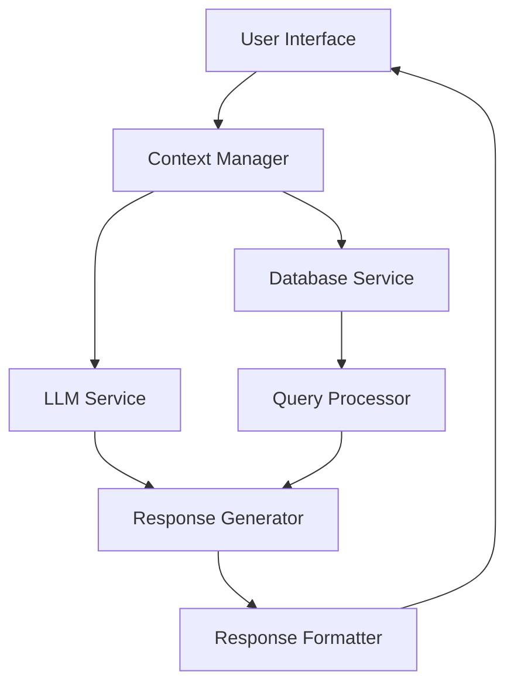

# Design Document: LLM Vendor Context Management

## Overview

This design document outlines the architecture and implementation details for enhancing the FinOpSysAI application with improved LLM model integration and vendor context management. The system will provide a secure, context-aware chat interface that connects to multiple LLM models with failover capabilities and enforces strict vendor-specific data access through a PostgreSQL database.

The design focuses on maintaining security boundaries, ensuring sensitive identifiers are never exposed to the frontend, and providing well-formatted, insightful responses to natural language queries about financial data.

## Architecture

The system follows a layered architecture with clear separation of concerns:



### Key Components

1. **User Interface Layer**
   - Streamlit-based web interface
   - Query input and result display
   - Model selection controls
   - Session management UI

2. **Context Manager**
   - Maintains vendor context throughout the session
   - Orchestrates interactions between LLM and database services
   - Enforces security boundaries and access controls

3. **LLM Service**
   - Manages connections to multiple LLM providers
   - Implements failover mechanism
   - Applies response guidelines and restrictions

4. **Database Service**
   - Manages PostgreSQL connection
   - Enforces vendor filtering on all queries
   - Handles data retrieval and transformation

5. **Query Processor**
   - Converts natural language to SQL
   - Validates and sanitizes queries
   - Applies vendor context filters

6. **Response Generator**
   - Processes query results
   - Generates natural language summaries
   - Applies security filters

7. **Response Formatter**
   - Formats responses with appropriate styling
   - Organizes information into logical sections
   - Enhances readability with proper formatting

## Components and Interfaces

### Context Manager

The Context Manager serves as the central orchestrator for the application, maintaining session state and vendor context.

```python
class ContextManager:
    def __init__(self):
        self.llm_service = LLMService()
        self.db_service = DatabaseService()
        self.query_processor = QueryProcessor()
        self.response_generator = ResponseGenerator()
        self.response_formatter = ResponseFormatter()
        self.vendor_id = None
        self.case_id = None
        self.session_active = False
        
    def initialize_system(self) -> bool:
        """Initialize LLM and database connections"""
        llm_initialized = self.llm_service.initialize()
        db_initialized = self.db_service.initialize()
        return llm_initialized and db_initialized
        
    def set_vendor_context(self, case_id: str) -> bool:
        """Set vendor context based on case_id"""
        vendor_id = self.db_service.get_vendor_id_for_case(case_id)
        if vendor_id:
            self.vendor_id = vendor_id
            self.case_id = case_id
            self.session_active = True
            return True
        return False
        
    def process_query(self, user_question: str) -> dict:
        """Process user query within vendor context"""
        if not self.session_active:
            return {"error": "Vendor context not established"}
            
        sql_query = self.query_processor.generate_sql(user_question, self.vendor_id)
        query_result = self.db_service.execute_query(sql_query)
        
        # Process results while maintaining dual data structure
        internal_result = query_result.copy()  # Complete data for processing
        display_result = self.filter_sensitive_data(query_result)  # Filtered for display
        
        response = self.response_generator.generate(
            user_question, 
            internal_result,  # Full data for processing
            self.llm_service.get_current_model()
        )
        
        formatted_response = self.response_formatter.format(
            response, 
            display_result,  # Filtered data for display
            user_question
        )
        
        return {
            "formatted_response": formatted_response,
            "display_result": display_result,
            "query_type": self.classify_query_type(user_question)
        }
        
    def filter_sensitive_data(self, data: dict) -> dict:
        """Filter sensitive identifiers from display data"""
        # Implementation details for filtering case_id, vendor_id, etc.
        pass
        
    def classify_query_type(self, query: str) -> str:
        """Classify query type for appropriate formatting"""
        # Implementation details for query classification
        pass
```

### LLM Service

The LLM Service manages connections to multiple LLM providers with failover capabilities.

```python
class LLMService:
    def __init__(self):
        self.models = {
            "openai": None,
            "gemini": None,
            "ollama": None
        }
        self.current_model = None
        self.response_guidelines = ResponseGuidelines()
        
    def initialize(self) -> bool:
        """Initialize LLM connections with failover"""
        if self._initialize_openai():
            self.current_model = "openai"
            return True
        elif self._initialize_gemini():
            self.current_model = "gemini"
            return True
        elif self._initialize_ollama():
            self.current_model = "ollama"
            return True
        return False
        
    def _initialize_openai(self) -> bool:
        """Initialize OpenAI connection"""
        # Implementation details
        pass
        
    def _initialize_gemini(self) -> bool:
        """Initialize Gemini connection"""
        # Implementation details
        pass
        
    def _initialize_ollama(self) -> bool:
        """Initialize Ollama connection"""
        # Implementation details
        pass
        
    def switch_model(self, model_name: str) -> bool:
        """Switch to specified model if available"""
        if model_name in self.models and self.models[model_name]:
            self.current_model = model_name
            return True
        return False
        
    def get_current_model(self) -> str:
        """Get current active model"""
        return self.current_model
        
    def generate_response(self, prompt: str, context: dict) -> str:
        """Generate response using current model with security guidelines"""
        # Apply response guidelines to prevent sensitive data exposure
        safe_prompt = self.response_guidelines.create_safe_prompt(prompt, context)
        
        # Use current model to generate response
        if self.current_model == "openai":
            response = self._generate_openai_response(safe_prompt)
        elif self.current_model == "gemini":
            response = self._generate_gemini_response(safe_prompt)
        elif self.current_model == "ollama":
            response = self._generate_ollama_response(safe_prompt)
        else:
            return "No LLM model available"
            
        # Clean response to ensure no sensitive data
        clean_response = self.response_guidelines.clean_response(response)
        return clean_response
```

### Database Service

The Database Service manages PostgreSQL connections and enforces vendor filtering.

```python
class DatabaseService:
    def __init__(self):
        self.connection = None
        self.rate_limiter = RateLimiter()
        
    def initialize(self) -> bool:
        """Initialize database connection"""
        try:
            # Connect to PostgreSQL using environment variables
            self.connection = self._create_connection()
            return self.connection is not None
        except Exception as e:
            logging.error(f"Database connection failed: {str(e)}")
            return False
            
    def _create_connection(self):
        """Create database connection using environment variables"""
        # Implementation details
        pass
        
    def get_vendor_id_for_case(self, case_id: str) -> str:
        """Get vendor_id for the specified case_id"""
        query = "SELECT vendor_id FROM ai_invoice WHERE case_id = %s LIMIT 1"
        result = self._execute_raw_query(query, (case_id,))
        if result and len(result) > 0:
            return result[0]["vendor_id"]
        return None
        
    def get_available_case_ids(self) -> list:
        """Get list of available case_ids"""
        query = "SELECT DISTINCT case_id FROM ai_invoice ORDER BY case_id"
        result = self._execute_raw_query(query)
        return [row["case_id"] for row in result]
        
    def execute_query(self, sql_query: str) -> dict:
        """Execute SQL query with rate limiting and vendor filtering validation"""
        # Check rate limit
        if not self.rate_limiter.check_limit():
            return {"error": "Rate limit exceeded"}
            
        # Validate query has vendor filter
        if not self._validate_vendor_filter(sql_query):
            logging.warning("Query attempted without vendor filter")
            return {"error": "Invalid query: missing vendor filter"}
            
        # Execute query
        try:
            result = self._execute_raw_query(sql_query)
            return {
                "data": result,
                "row_count": len(result),
                "success": True
            }
        except Exception as e:
            logging.error(f"Query execution failed: {str(e)}")
            return {
                "error": str(e),
                "success": False
            }
            
    def _execute_raw_query(self, query: str, params=None):
        """Execute raw SQL query with parameters"""
        # Implementation details
        pass
        
    def _validate_vendor_filter(self, query: str) -> bool:
        """Validate that query includes vendor_id filter"""
        # Implementation details to ensure vendor_id is in WHERE clause
        pass
```

### Query Processor

The Query Processor converts natural language to SQL with vendor filtering.

```python
class QueryProcessor:
    def __init__(self):
        self.schema_info = None
        
    def load_schema_info(self):
        """Load database schema information"""
        # Implementation details
        pass
        
    def generate_sql(self, user_question: str, vendor_id: str) -> str:
        """Generate SQL from natural language with vendor filtering"""
        # Use LLM to generate SQL
        # Ensure vendor_id filter is applied
        # Validate and sanitize SQL
        pass
        
    def validate_sql(self, sql_query: str) -> bool:
        """Validate SQL query for security"""
        # Check for SQL injection attempts
        # Ensure only SELECT operations
        # Verify vendor filtering
        pass
        
    def sanitize_sql(self, sql_query: str) -> str:
        """Sanitize SQL query"""
        # Remove dangerous operations
        # Standardize formatting
        pass
```

### Response Generator

The Response Generator processes query results and generates natural language summaries.

```python
class ResponseGenerator:
    def __init__(self):
        self.llm_service = None
        
    def set_llm_service(self, llm_service):
        """Set LLM service reference"""
        self.llm_service = llm_service
        
    def generate(self, user_question: str, query_result: dict, model: str) -> str:
        """Generate natural language response from query results"""
        # Prepare context for LLM
        context = self._prepare_context(user_question, query_result)
        
        # Generate response using LLM
        response = self.llm_service.generate_response(user_question, context)
        
        return response
        
    def _prepare_context(self, user_question: str, query_result: dict) -> dict:
        """Prepare context for LLM response generation"""
        # Extract relevant information from query result
        # Format data for LLM consumption
        # Include query classification
        pass
```

### Response Formatter

The Response Formatter enhances responses with proper formatting and organization.

```python
class ResponseFormatter:
    def __init__(self):
        pass
        
    def format(self, response: str, display_result: dict, user_question: str) -> str:
        """Format response with appropriate styling and organization"""
        query_type = self._classify_query_type(user_question)
        
        # Apply section headers based on query type
        formatted_response = self._apply_section_headers(response, query_type)
        
        # Format currency values
        formatted_response = self._format_currency_values(formatted_response)
        
        # Apply bold formatting to important terms
        formatted_response = self._highlight_important_terms(formatted_response)
        
        # Organize with proper line breaks
        formatted_response = self._organize_line_breaks(formatted_response)
        
        return formatted_response
        
    def _classify_query_type(self, query: str) -> str:
        """Classify query type for appropriate formatting"""
        # Financial, Product, Payment, Trend, or General
        pass
        
    def _apply_section_headers(self, response: str, query_type: str) -> str:
        """Apply appropriate section headers based on query type"""
        # Implementation details
        pass
        
    def _format_currency_values(self, text: str) -> str:
        """Format currency values with appropriate symbols"""
        # Implementation details
        pass
        
    def _highlight_important_terms(self, text: str) -> str:
        """Apply bold formatting to important terms"""
        # Implementation details
        pass
        
    def _organize_line_breaks(self, text: str) -> str:
        """Organize text with proper line breaks"""
        # Implementation details
        pass
```

## Data Models

### Session Context

```python
class SessionContext:
    def __init__(self):
        self.vendor_id = None
        self.case_id = None
        self.active = False
        self.start_time = None
        self.last_activity = None
        self.query_count = 0
        
    def activate(self, vendor_id: str, case_id: str):
        """Activate session with vendor context"""
        self.vendor_id = vendor_id
        self.case_id = case_id
        self.active = True
        self.start_time = datetime.now()
        self.last_activity = self.start_time
        
    def update_activity(self):
        """Update last activity timestamp"""
        self.last_activity = datetime.now()
        self.query_count += 1
        
    def is_expired(self, timeout_seconds: int) -> bool:
        """Check if session is expired"""
        if not self.active:
            return True
        elapsed = (datetime.now() - self.last_activity).total_seconds()
        return elapsed > timeout_seconds
```

### Query Result

```python
class QueryResult:
    def __init__(self, raw_data: list):
        self.raw_data = raw_data
        self.filtered_data = self._filter_sensitive_data(raw_data)
        self.row_count = len(raw_data) if raw_data else 0
        self.column_count = len(raw_data[0].keys()) if raw_data and len(raw_data) > 0 else 0
        
    def _filter_sensitive_data(self, data: list) -> list:
        """Filter sensitive identifiers from display data"""
        if not data:
            return []
            
        filtered = []
        sensitive_columns = ['case_id', 'CASE_ID', 'vendor_id', 'VENDOR_ID', 
                            'customer_id', 'CUSTOMER_ID', 'bill_id', 'BILL_ID']
        
        for row in data:
            filtered_row = {k: v for k, v in row.items() if k not in sensitive_columns}
            filtered.append(filtered_row)
            
        return filtered
```

### Item Expansion

```python
class ItemExpansion:
    def __init__(self):
        self.item_columns = {
            'descriptions': ['items_description', 'ITEMS_DESCRIPTION'],
            'prices': ['items_unit_price', 'ITEMS_UNIT_PRICE'],
            'quantities': ['items_quantity', 'ITEMS_QUANTITY']
        }
        
    def expand_items(self, data: list) -> list:
        """Expand invoice items into individual rows"""
        if not data:
            return []
            
        expanded_data = []
        
        for row in data:
            # Check if row has item columns
            has_items = any(any(col in row for col in cols) for cols in self.item_columns.values())
            
            if not has_items:
                # No items to expand, keep row as is
                expanded_data.append(row)
                continue
                
            # Extract item data
            descriptions = self._extract_item_data(row, self.item_columns['descriptions'])
            prices = self._extract_item_data(row, self.item_columns['prices'])
            quantities = self._extract_item_data(row, self.item_columns['quantities'])
            
            # Determine number of items
            item_count = max(len(descriptions), len(prices), len(quantities))
            
            if item_count == 0:
                # No items found, keep row as is
                expanded_data.append(row)
                continue
                
            # Create expanded rows
            for i in range(item_count):
                expanded_row = row.copy()
                
                # Add item-specific data
                if i < len(descriptions):
                    expanded_row['item_description'] = descriptions[i]
                if i < len(prices):
                    expanded_row['item_price'] = prices[i]
                if i < len(quantities):
                    expanded_row['item_quantity'] = quantities[i]
                    
                expanded_data.append(expanded_row)
                
        return expanded_data
        
    def _extract_item_data(self, row: dict, possible_columns: list) -> list:
        """Extract item data from row using possible column names"""
        for col in possible_columns:
            if col in row and row[col]:
                return self._parse_item_data(row[col])
        return []
        
    def _parse_item_data(self, data_str: str) -> list:
        """Parse item data from string (JSON array or CSV)"""
        if not data_str:
            return []
            
        # Try JSON format first
        try:
            return json.loads(data_str)
        except json.JSONDecodeError:
            # Try CSV format
            return [item.strip() for item in data_str.split(',')]
```

## Error Handling

The system implements a comprehensive error handling strategy:

1. **Graceful Degradation**
   - LLM model failover when primary model is unavailable
   - Clear error messages when all models fail
   - Fallback to basic functionality when advanced features fail

2. **User-Friendly Error Messages**
   - Database connection errors with troubleshooting steps
   - Rate limit notifications with wait time
   - Query validation errors with guidance

3. **Security-Focused Error Handling**
   - No exposure of internal system details in error messages
   - Logging of security-related errors for monitoring
   - Automatic termination of potentially harmful operations

4. **Error Types and Responses**

   | Error Type | Response Strategy |
   |------------|-------------------|
   | LLM Connection Failure | Attempt failover to next model |
   | Database Connection Failure | Display connection error with troubleshooting steps |
   | Rate Limit Exceeded | Inform user of limit and wait time |
   | Invalid Query | Explain issue without revealing system details |
   | Security Violation | Log event, terminate operation, display generic message |
   | Session Timeout | Prompt user to re-establish vendor context |

## Testing Strategy

The testing strategy covers multiple layers to ensure system reliability and security:

1. **Unit Testing**
   - Test individual components in isolation
   - Mock dependencies for controlled testing
   - Focus on edge cases and error handling

2. **Integration Testing**
   - Test interactions between components
   - Verify LLM model failover functionality
   - Test database connection and query processing

3. **Security Testing**
   - Test vendor isolation enforcement
   - Verify sensitive data filtering
   - Test SQL injection protection
   - Verify rate limiting functionality

4. **End-to-End Testing**
   - Test complete user workflows
   - Verify response formatting and enhancement
   - Test item expansion functionality

5. **Test Cases**

   | Test Category | Test Cases |
   |---------------|------------|
   | LLM Integration | - Test OpenAI connection<br>- Test Gemini fallback<br>- Test Ollama fallback<br>- Test model switching |
   | Vendor Context | - Test case_id selection<br>- Test vendor_id retrieval<br>- Test context persistence<br>- Test session timeout |
   | Query Processing | - Test SQL generation<br>- Test vendor filter enforcement<br>- Test query validation<br>- Test rate limiting |
   | Data Security | - Test sensitive data filtering<br>- Test response guidelines<br>- Test dual data structure<br>- Test case insensitive filtering |
   | Response Formatting | - Test currency formatting<br>- Test section headers<br>- Test line break organization<br>- Test term highlighting |
   | Item Expansion | - Test JSON array parsing<br>- Test CSV parsing<br>- Test mixed format handling<br>- Test expansion logic |

## Security Considerations

Security is a primary concern for this system, with multiple layers of protection:

1. **Vendor Isolation**
   - Strict vendor_id filtering on all queries
   - Session-persistent vendor context
   - Validation of vendor filter presence

2. **Data Protection**
   - Dual data structure (internal vs. display)
   - Filtering of sensitive identifiers
   - Response guidelines enforcement

3. **Query Security**
   - SQL injection protection
   - Query validation and sanitization
   - Restriction to SELECT operations

4. **Session Security**
   - Proper session timeout
   - Secure context establishment
   - Activity tracking and monitoring

5. **Response Security**
   - Replacement of specific identifiers with generic terms
   - Cleaning of LLM responses
   - Prevention of sensitive data leakage